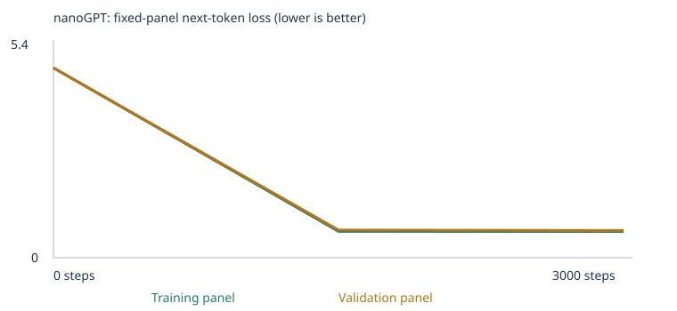
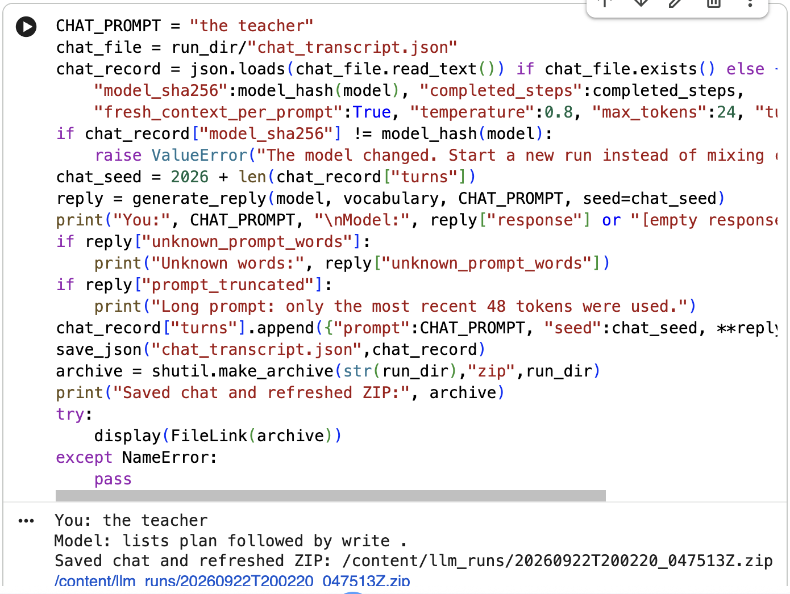

# Custom LLM with nanoGPT — Class 4 Assignment

A tiny word-token language model trained from scratch with Karpathy's
[nanoGPT](https://github.com/karpathy/nanoGPT) (2 blocks, 4 heads, 64-number embeddings,
48-token context). Two experiments were run with identical settings:

1. **Starter** — the supplied classroom corpus only.
2. **Expanded** — classroom corpus + two teaching files I wrote for the **opposites** and
   **sequence** extension categories.

Both were evaluated with the unchanged 48-case language eval suite before and after training.
This is a narrow sentence-continuation model, not a chat assistant.

## Repository map

| What | Where |
|---|---|
| Executed notebooks (all outputs visible) | [`notebooks/custom_llm_starter.ipynb`](notebooks/custom_llm_starter.ipynb), [`notebooks/custom_llm_expanded.ipynb`](notebooks/custom_llm_expanded.ipynb) |
| My added corpus files | [`corpus/opposites_teaching.txt`](corpus/opposites_teaching.txt), [`corpus/sequence_teaching.txt`](corpus/sequence_teaching.txt) |
| Starter run results (full) | [`llm_runs/starter/`](llm_runs/starter/) (run id `20260922T192506_845021Z`) |
| Expanded run results (full) | [`llm_runs/expanded/`](llm_runs/expanded/) (run id `20260922T200220_047513Z`) |
| Fixed eval suite (unchanged) | [`evals/language_evals.json`](evals/language_evals.json) |
| Eval runner / chat interface | [`run_evals.py`](run_evals.py), [`chat.py`](chat.py) |
| nanoGPT source (pinned commit `3adf61e`) | [`nanogpt_model.py`](nanogpt_model.py) |
| Chat screenshots | [`evidence/`](evidence/) |

`run_evals.py`, `chat.py`, `evals/language_evals.json` and `requirements.txt` are the course
support files at commit `f83578f` of the sample repo; their SHA-256 hashes match the ones the
notebook checks.

## How to run

**Notebook (reproduces a run):** open a notebook in Google Colab (default CPU runtime) or
locally with `pip install -r requirements.txt`. For the expanded run, put the two files from
`corpus/` into a `corpus/` folder next to the notebook. Then Run All. Each run creates a new
`llm_runs/<timestamp>/` folder and ZIP.

**Rerun the 48 evals on a saved model:**

```bash
pip install -r requirements.txt
python run_evals.py --model llm_runs/expanded/model.pt --output my_eval_rerun
```

**Chat with the trained model (terminal):**

```bash
python chat.py --model llm_runs/expanded/model.pt --transcript my_chat.json
```

Type a prompt, press Enter, and type `/quit` to exit. Each prompt starts a fresh context.
Prompts are limited to 48 tokens, and unknown words are listed. Replies never change the
weights or the corpus. `model.pt` holds the full network and vocabulary.
`checkpoint.json` is only for the embedding viewer.

## 1. My three choices

| Setting | Value | Why |
|---|---|---|
| Corpus | Starter: `classroom`. Expanded: `classroom` + 2 files in `corpus/` | Baseline first, then targeted additions for two eval categories that had 0% vocabulary coverage |
| Training steps | 3,000 (both runs) | Suggested starting budget; keeping it equal makes the two runs comparable |
| Learning rate | 0.001 (warmup + cosine decay) | Suggested default. Too large an update can overshoot and make loss unstable or non-finite. Too small an update learns very slowly within 3,000 steps |

**Prediction before training (from the notebook):** training loss would fall and samples would
look more like the training sentences, while unfamiliar words and new patterns would still fail.

**What happened:** that matched. Loss fell from ~4.93 to ~0.71 in the first half. Samples went
from random word lists to template-shaped sentences. Every eval case with unknown words
stayed unscorable no matter how much training was done.

## 2. Data, vocabulary and run facts

| | Starter | Expanded |
|---|---:|---:|
| Added files | 0 | 2 (204 extracted passages, 197 new unique) |
| Train / validation passages (90/10 split) | 4,132 / 460 | 4,310 / 479 |
| Vocabulary size (incl. `<UNK>`,`<BOS>`,`<EOS>`) | 136 | 249 |
| Training unknown-token rate | 0.0% | 0.0% |
| Held-out unknown-token rate | 0.0% | 0.13% |
| Reserved eval passages removed before split | 160 | 160 |
| Parameters | 111,872 | 119,104 |
| Completed steps / interrupted | 3,000 / no | 3,000 / no |
| Elapsed time | 58.5 s | 59.7 s |
| Hardware | Colab CPU, torch 2.11.0+cpu | same |

Both runs stayed under the 509-type vocabulary cap, so no training word was dropped
([starter](llm_runs/starter/vocabulary_report.json),
[expanded](llm_runs/expanded/vocabulary_report.json) vocabulary reports). The files are plain
UTF-8 TXT, so no PDF extraction was needed.
[`corpus_manifest.json`](llm_runs/expanded/corpus_manifest.json) shows 0 warnings, and the
SHA-256 of each file in `corpus/` matches the manifest.

**Corpus sources and permissions:** the classroom sentences are generated by the course
notebook. The two added files were written for this assignment (with AI assistance) and
contain only simple invented sentences, with no copyrighted or personal material.

## 3. Loss (fixed panels of 20 training + 20 validation documents)

Values are the mean over non-padding next-token targets in fixed panels of 20 training and
20 validation documents. These are small estimates, not full-corpus losses. Loss values from
different corpora and vocabularies are not directly comparable.

| Run | Step | Training loss | Validation loss |
|---|---:|---:|---:|
| Starter | 0 | 4.9263 | 4.9275 |
| Starter | 1500 | 0.6821 | 0.7182 |
| Starter | 3000 | 0.6783 | 0.7061 |
| Expanded | 0 | 5.5560 | 5.5728 |
| Expanded | 1500 | 0.7226 | 0.7698 |
| Expanded | 3000 | 0.7153 | 0.7638 |

Starter: 
Expanded: 

The untrained loss is about ln(vocabulary size): ln 136 ≈ 4.91 and ln 249 ≈ 5.52. That is what
near-uniform guessing gives. Almost all learning happened before step 1500. Validation stays
close to training loss, so there is no sign of overfitting. However, validation uses the same
templates as training, so it does not test generalization to new kinds of sentences. Raw
data: `history.json` / `training.csv` in each run folder.

## 4. Samples: untrained → halfway → final (temperature 0.8, seed 2026)

Full files: starter [`samples/`](llm_runs/starter/samples/), expanded [`samples/`](llm_runs/expanded/samples/).

**Expanded run**

| Step | First sample |
|---|---|
| 0 | `traffic by travel arrived car market bread late box teacher earlier understand happens …` |
| 1500 | `the report about the car explains the journey in detail .` |
| 3000 | `the report about the car explains the journey in detail .` |

**Starter run**

| Step | First sample |
|---|---|
| 0 | `pear professor bond doctor course harvest team physician journey …` |
| 1500 | `our school has a question about the new educator and lesson .` |
| 3000 | `our school has a question about the new educator and lesson .` |

The visible change is from random word lists (step 0) to grammatical template sentences. The
halfway and final samples are nearly identical: 3 of 4 samples are the same in each run. This
matches the flat loss after step 1500, so the second half of training changed very little.

## 5. Tracing one word: token → ID → vector → gradient → update

From [`tokenization.json`](llm_runs/expanded/tokenization.json) and
[`inspection.json`](llm_runs/expanded/inspection.json) (expanded run):

- **Tokens and IDs:** the passage `today the hospital focused on patient and the new therapist .`
  becomes IDs `[1, 223, 216, 105, 92, 149, 159, 12, 216, 141, 218, 4, 2]`. The first ID, 1, is
  `<BOS>` and the last, 2, is `<EOS>`. The word `the` is ID 216 both times it appears. IDs
  are just row numbers in the vocabulary, not amounts of meaning.
- **Embedding:** the word **`customer` is ID 61**. Its row in the 249 × 64 embedding table is a
  vector of 64 numbers. The first six values are:
  - before training: `[-0.0016, -0.0065, 0.0082, -0.0135, 0.0039, 0.0064]` (small random values)
  - after training: `[0.1674, -0.1098, -0.0009, 0.0543, -0.1310, -0.0260]`

  Training moved these numbers so that words used in similar contexts end up with vectors
  that produce similar predictions.
- **One real gradient and update** (step 0, coordinate 0 of `customer`):
  - value before: −0.0016004
  - gradient: +0.00012138
  - learning rate: 1e-5 (the first warmup step)
  - value after: −0.0016104

  The gradient is positive, which means that increasing this weight would increase the loss.
  AdamW therefore moved the weight down, by about 1e-5. AdamW normalizes the gradient, so on
  the first step each weight moves by about one learning rate in the direction opposite its
  gradient. Weight decay adds a tiny extra shrink. That is why the change is about 1e-5 rather
  than learning rate × gradient.
- **Prediction → loss:** after the prefix `the customer`, the top next-token probabilities were:

  | | Top 5 next tokens |
  |---|---|
  | Before training | `customer` 0.0071, `report` 0.0063, `read` 0.0063, `lecturer` 0.0061, `explains` 0.0058 (≈ uniform 1/249 = 0.004) |
  | After training | `compared` 0.215, `ordered` 0.168, `selected` 0.156, `recommended` 0.150, `reviewed` 0.136 |

  The loss is −log(probability of the actual next word). Before training, any real next word
  had probability ≈ 0.004, so the loss was ≈ 5.5. After training, plausible verbs get about
  0.15–0.2 each, so the loss is ≈ 1.6–1.9 at this position. Averaged over all positions in
  the panel, the loss is ≈ 0.7.

The starter run shows the same pattern (`customer` = ID 28; its top predictions after
training are `reviewed`, `recommended`, `ordered`, `selected`, `compared`); see
[starter inspection](llm_runs/starter/inspection.json).

### 5b. Which neighbors changed?

Nearest neighbors below are by cosine similarity using all 64 dimensions. They are computed
from the initial and final embeddings saved in
[`checkpoint.json`](llm_runs/expanded/checkpoint.json) (expanded run).

| Word | Top neighbors before training | Top neighbors after training |
|---|---|---|
| customer | served .28, coat .28, school .27 | shopper .97, client .97, buyer .96, consumer .96 |
| nurse | last .35, item .33, shopper .32 | therapist .99, dentist .98, physician .98, surgeon .98 |
| read | first .35, actions .32, arrived .31 | open .90, wash .90, fill .88, pack .87 |
| hot | car .30, payment .28, travel .26 | empty .80, soft .78, early .76, cold .72 |

Before training, the neighbors are random, with similarity around 0.3. After training, words
that fill the same slot in the corpus templates cluster tightly:
- customers with other customers
- health workers with other health workers
- the action verbs from my sequence file with each other
- the adjectives from my opposites file with each other

Similar here means "used in the same position", not "means the same thing". For example,
`hot` and `cold` went from −0.10 to 0.72. They became *similar* vectors even though they are
opposites, because my file always uses them in the same sentence frames. This also explains
the `noisy → quiet` failure. After training, `noisy` is slightly closer to `late` (0.61) than
to `quiet` (0.55), and the model picked `late`.

**Why the 3D viewer's closeness is imperfect:** the viewer uses PCA to squeeze 64 dimensions
into 3, which throws away most of the variation. Two words can look close in 3D but be far
apart in 64D, or the other way round. The cosine numbers above use the full 64 dimensions.

## 6. Attention and temperature

**Attention:** each position builds a query and compares it with the keys of all *earlier*
positions. A causal mask blocks future tokens. A softmax over those scores decides how much
of each earlier token's value vector to mix in. That is how `the customer` can shape the
prediction of the word after it. The notebook plots head 1 of block 1.

**Temperature** divides the logits before the softmax. It changes only sampling, never the
weights. The comparison below uses the same model, seed and start token, from
[`temperature_comparison.json`](llm_runs/expanded/temperature_comparison.json) (expanded run):

| T | Samples |
|---|---|
| 0.3 | `the important software was mentioned in the data report yesterday .` / `the important taxi was mentioned in the travel report yesterday .` |
| 0.8 | `we learned about the important teacher during a discussion of course .` / `the new bicycle was mentioned in the travel report yesterday .` |
| 1.2 | `traffic by travel , the train .` / `today the kitchen focused on harvest and the important pear .` |

A low temperature repeats the single most common template. A high temperature produces more
variety and more broken sentences (`traffic by travel , the train .`). In the starter run, the
0.8 and 1.2 samples were identical, because the model is very confident on its narrow
templates.

## 7. The 48-case language evals: four result sets

**Scoring:** only the prompt is fed to the model. A case scores 1 if the correct word has the
highest probability of the four choices, and 0 otherwise; ties get 0. If a prompt word or an
answer choice is outside the vocabulary, the case is *unscorable* and counts as 0 in all-case
success. The free continuation is saved separately and is not scored.

| Experiment / stage | Correct | All-case success | Scorable | Scorable accuracy | Coverage | Results |
|---|---:|---:|---:|---:|---:|---|
| Starter untrained | 9 | 18.8% | 24 | 37.5% | 50.0% | [folder](llm_runs/starter/language_evals/untrained/) |
| Starter trained | 20 | 41.7% | 24 | 83.3% | 50.0% | [folder](llm_runs/starter/language_evals/final/) |
| Expanded untrained | 8 | 16.7% | 27 | 29.6% | 56.3% | [folder](llm_runs/expanded/language_evals/untrained/) |
| Expanded trained | **25** | **52.1%** | 27 | **92.6%** | 56.3% | [folder](llm_runs/expanded/language_evals/final/) |

Each folder has `eval_cases.json`, `eval_results.csv/.json` (every case, including failures
and free continuations) and `eval_summary.json`. Leakage checks are in each run's
`eval_separation.json`.

**By category** (correct / 3 or 8; `u` = unscorable cases):

| Category | Starter untr. | Starter trained | Expanded untr. | Expanded trained |
|---|---|---|---|---|
| domain_context (8) | 3 | 8 | 2 | 8 |
| domain_place (8) | 3 | 8 | 3 | 8 |
| new_wording (8) | 3 | 4 | 2 | **7** |
| opposites (3) | 0 (3u) | 0 (3u) | 1 | **2** |
| sequence (3) | 0 (3u) | 0 (3u) | 0 (3u) | 0 (3u) |
| negation, reference, grammar, spatial, everyday, analogies (3 each) | 0 (all u) | 0 (all u) | 0 (all u) | 0 (all u) |

### What changed and why

- **Learned patterns:** the 16 starter-pattern cases went from 6 → 16 correct (starter) and
  5 → 16 (expanded). The vocabulary was the same before and after training, so this gain comes
  purely from training.
- **Vocabulary coverage — opposites:** in the starter run, all 3 opposites cases were
  unscorable (`opposite`, `is`, `hot`, `noisy` … were unknown). After adding
  `opposites_teaching.txt`, all 3 became scorable (coverage change). After training, the model
  got `hot → cold` and `empty → full` right (learned pattern). It failed
  `noisy → quiet` and picked `late` instead. Its free continuation for `the opposite of hot is`
  was `short .`, so the four-choice ranking was correct even though free generation was not.
- **Sequence — partly fixed coverage, still 0 points:** `sequence_teaching.txt` taught
  `first/then/last/earlier/action`, which cut the unknown words sharply, but all 3 cases are
  still unscorable:
  - `lang_37` (`first wash the cup . then dry it . the last action is`): the only unknown word
    is **`it`**, which never appears in my file. The model's free continuation was **`dry .`**,
    which is the correct answer, but the case earns 0 because of that one missing word.
  - `lang_38`: the choice **`supper`** is unknown. My only sentence containing "supper" was
    randomly placed in the validation split, and the vocabulary is built from training text
    only.
  - `lang_39`: `that` and `vehicle` are missing.
- **new_wording 4/8 → 7/8:** the vocabulary for these 8 cases was the same in both runs, so
  this difference comes from a different random initialization and a different mix of
  training data. It is *not* evidence that the opposites/sequence files taught these cases.
  With only 8 cases, a 3-case swing is within run-to-run noise.
- **Untouched categories** (negation, reference, grammar, spatial, everyday knowledge,
  analogies) stay unscorable because I added no material for them. More training steps
  cannot add words that are not in the vocabulary.

### Why I picked opposites and sequence

Both had 0% coverage in the starter run and could be taught with short, regular sentences. I
wrote varied examples with different word pairs, people and situations, for example
`hot/cold` with soup and juice, and `read → write` and `buy → cook` action orders. I did not
copy any eval prompt, answer list or output.

### Leakage checks

- The notebook removed 160 generated classroom passages that contained reserved eval prompts
  before splitting (see `eval_separation.json`).
- The runner rejects imported files that contain exact test prompts, and `corpus/` is
  separate from `evals/`.
- I also checked that none of the 48 prompts appears in the expanded `corpus.txt`, and that no
  6-word sequence from any prompt appears in my 204 added passages. Some ordinary words
  overlap (e.g. `hot`, `cold`), which the assignment allows.

These tests guided my choices, so they are a **public development benchmark**, not an unseen
test of generalization.

## 8. Chat interface and real interactions

The chat interface is notebook section 10, run on the model trained in the same session. The
equivalent terminal interface is `chat.py` (launch command above). Settings: temperature 0.8,
up to 24 tokens, fresh context for each prompt.

**Expanded run** (`model_sha256 11a15e53…`, 3,000 steps, [transcript](llm_runs/expanded/chat_transcript.json))

| You | Model |
|---|---|
| the teacher | lists read followed by build . |
| the teacher | lists plan followed by write . |
| the nurse | was mentioned in the treatment report began . |

**Starter run** (`model_sha256 700c31cd…`, 3,000 steps, [transcript](llm_runs/starter/chat_transcript.json))

| You | Model |
|---|---|
| the customer | selected the item after checking the price . |
| the nurse | selected the important therapist team discussed the health . |
| the teacher | reviewed the product after checking the price . |

Screenshots:
[expanded – teacher](evidence/expanded_chat_teacher.png),
[expanded – nurse](evidence/expanded_chat_nurse.png),
[starter – teacher](evidence/starter_chat_teacher.png),
[starter – nurse](evidence/starter_chat_nurse.png)



**Observed limitations:**

- `the nurse → was mentioned in the treatment report began .` glues two templates together
  and produces an ungrammatical sentence.
- `the teacher → lists read followed by build .` and `lists plan followed by write .` show that
  the model learned the *form* of my sequence sentences but swapped the action pairs. My
  teaching file only has `read followed by write` and `plan followed by build`. The model
  learned "a verb, then followed by, then a verb", not which actions belong together.
- The model continues text; it does not answer questions. A prompt containing words outside
  its 249-word vocabulary becomes `<UNK>` tokens.

## 9. Limitation and next experiment

**Main limitation:** the eval score is limited more by vocabulary than by learning. 21 of 48
cases are unscorable even after the expansion. In `lang_37`, the model's free continuation was
correct, yet the case scored 0 because one common word (`it`) was missing.

**Next experiment:** add a third teaching file for **negation**, and patch the coverage gaps
found above. That means using `it`, `that`, `vehicle` and `supper` in several training
sentences each, so a random split cannot remove them all. Then retrain at the same 3,000 steps
and learning rate 0.001, and check whether the 3 sequence and 3 negation cases become
scorable, and then whether they become correct. A second, separate check would be a few new
test prompts written *after* training, to see whether any gain carries over beyond this public
benchmark.
